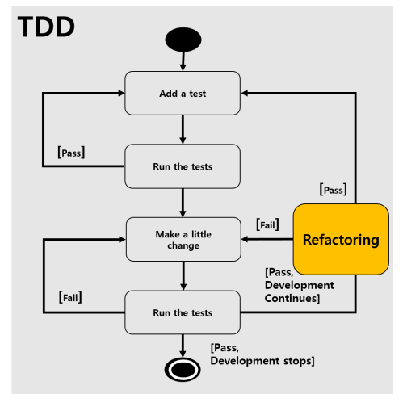

# 유연한 사고, 남탓하지 않기

> README 파일은 이 문서를 읽어봐야한다는 파일입니다.

## TOC

- [엔지니어링이란?](#1-엔지니어링이란)
- [테스트 기법](#2-테스트-기법)
- [테스트 우선 개발](#3-테스트-우선-개발)
- [리팩토링](#4리팩토링)
- [테스트 주도 개발](#5-테스트-주도-개발)

## 1. 엔지니어링이란?

**과학과 엔지니어링의 차이 :**

- 과학은 무언가 새로운 사실을 밝혀낸다.
- 엔지니어링은 어떠한 문제를 해결한다.

**엔지니어링의 정의 :**

> 엔지니어링은 자연의 자원을 인류의 용도로 최적으로 전환하기 위한 과학의 응용이다.

**패턴 :**

> 패턴이란 알려진 문제의 일반적이고 재사용할 수 있는 해결법이다. 개발자는 고유한 문제를 해결해야하고, 이런 고유한 문제들은 좀 더 작은 하위 기술 문제를 가진다. 이 작은 기술 문제들 중 많은 일부는 과거 어디에 선가 여러 번 반복되고 해결된 적이 있다.

- 엔지니어는 현장에서 협업(사람과 사람, 시스템과 시스템 등 여러 연결된 협업 구조)을 하며 문제를 덜 심각한 문제로 나누고, 패턴등과 같은 다양한 도구를 이용해서 문제를 해결할 수 있다.

## 2. 테스트 기법

**테스트 종류 :**

- `수동 테스트`

  - 품질 담당자가 UI를 사용해 기능을 검증한다.
  - 최종 사용자의 사용 경험과 가장 비슷하게 검증가능
  - 실행 비용이 높고, 결과의 변동이 크다.
  - 가장 온전한 코드 실행
  - 인수 테스트

- `테스트 자동화`

  - 기능을 검증하는 코드를 작성
  - 테스트 코드 작성 비용이 소비되지만, 실행 비용이 낮고 결과의 신뢰도가 높음
  - 테스트 코드 작성과 관리가 개발자 역량에 크게 영향을 받음

---

**테스트 기법 :**

- `회귀 테스트`

  - > 소프트웨어 회귀(software regression)이란 특정 이벤트 이후에 잘돌아가던 기능이 의도한대로 독장하지 않게 만드는 소프트웨어 버그를 의미한다.

  - 회귀 테스트로는 이전의 실행 테스트를 재 실행하며 이전에 고쳐졌던 오류가 재현되는지 검사하는 방법이 많이 사용된다.
  - 회귀 버그를 찾는 모든 소프트웨어 테스트 방식은 회귀 테스트라고 할 수 있다.

- `인수 테스트`

  - 배치된 시스템을 대상으로 검증
  - 전체 시스템 이상 여부 신뢰도가 높음
  - 높은 비용
  - 피드백 품질이 낮음(현상만 알 수 있음)

- `단위 테스트`
  - 시스템의 하위 시스템을 대상으로 검증
  - 낮은 비용
  - 높은 피드백 품질
  - 전체 시스템 이상 여부 신뢰도가 낮음

## 3. 테스트 우선 개발

> 테스트 코드를 운영 코드보다 더 먼저 작성한다는 뜻!

**테스트 코드 특징 :**

- 테스트코드는 어떤 코드가 조건에 맞는지 검증할 수 있다.
- 테스트코드는 운영코드의 클라이언트 코드이다.
- 테스트코드는 구체적인 목표이며, 자가검증될 수 있고, 반복 실행될 수 있다.

**테스트 우선 개발 특징 :**

- 명확하고 검증 가능한 목표를 설정한 후 목표를 달성한다.
- 프로세스가 코딩에 앞선 목표 설정을 강요한다.
- 개발자는 자신이 풀어야할 문제를 구체적으로 이해해야한다.

## 4.리팩토링

> 작업 환경을 정리해서, 생산성, 지속성을 높이자! Re-factoring은 의미를 유지하며 코드베이스를 정리하는 것이다.

리팩토링을 했을 때 의미를 유지하는지 확인하는 방법은 테스트를 통해 할 수 있다.

## 5. 테스트 주도 개발

테스트 주도 개발 절차는 세 단계로 나뉘어 진다.

- `RED` : 실패하는 테스트 추가

  - 구체적인 하나의 요구사항을 검증하는 하나의 테스트를 추가
  - 추가된 테스트가 실패하는지 확인
  - 테스트가 왜 실패했는지 확인

- `GREEN` : 테스트 통과하고 최소한으로 통과한다.
  - 추가된 테스트를 비롯해 모든 테스트가 성공하도록 운영 코드를 변경
  - 테스트 성공은 요구사항 만족을 의미한다.
  - 테스트 성공을 위한 최소한의 변경을 해야한다.
- `REFACTOR` : 구현 설계를 개선하고 테스트 통과 유지
  - 코드 베이스 정리
  - 구현 설계 개선
    - 가독성
    - 적응성
    - 성능
  - 모든 테스트 성공을 전제

---

**켄트 백의 설계 규칙 :**

- Passes the tests : 테스트를 통과시키는 것이 중요한 목표
- Reveals intention : 코드가 어떤 일을 하는지 의도를 알 수 있게 한다.
- No duplication : 중복을 제거한다.
- Fewest elements : 가장 적은 요소 (필요하지 않은 코드 제거)

---

**테스트 주도 개발 세부 흐름 :**

  

